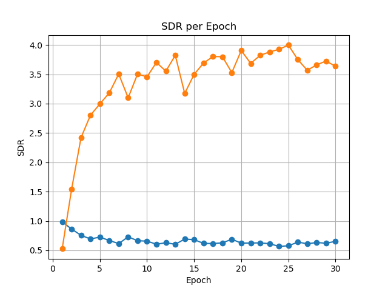

# 语音分离项目 (Speech Separation Project)

## 项目描述 (Project Description)

这个项目实现了基于置换不变训练 (PIT) 的多说话人语音分离模型。该模型可以将混合的多人语音信号分离成独立的语音流，使用双向LSTM网络和时频域掩码实现。

本项目是对论文 **《PERMUTATION INVARIANT TRAINING OF DEEP MODELS FOR SPEAKER-INDEPENDENT MULTI-TALKER SPEECH SEPARATION》** 的复现工作。

[论文地址](https://arxiv.org/abs/1607.00325)

此项目针对的是两说话人的场景，使用WSJ0-2mix数据集进行训练和评估。

## 论文概述 (Paper Overview)

论文提出了置换不变训练 (PIT) 方法解决了语音分离中的输出-标签分配问题。在传统方法中，由于不知道哪个输出对应哪个说话人，训练变得困难。PIT通过尝试所有可能的输出-标签排列，选择具有最小误差的排列来训练网络，从而解决了这个问题。

核心贡献:

- 提出PIT解决语音分离的输出-标签分配问题
- 无需预先知道说话人身份
- 分离性能优于传统方法

## 实现细节 (Implementation Details)

本项目实现包括：

- 使用双向LSTM网络作为分离器
- 基于时频掩码进行语音分离
- 实现PIT训练算法
- 使用SDR (Signal-to-Distortion Ratio)损失函数
- 支持模型评估和音频导出

主要技术点：

- STFT变换进行时频域特征提取
- 双向LSTM进行序列建模
- 残差连接提升梯度流
- 置换不变训练算法
- 使用mir_eval评估分离性能

## 数据集 (Dataset)

该项目使用WSJ0-2mix数据集，这是语音分离研究中的标准基准数据集：

- 包含两个说话人的混合语音
- 由Wall Street Journal (WSJ0) 语料库混合生成
- 训练集(tr)、验证集(cv)和测试集(tt)

本项目数据集路径设置：

```python
dataset_path = "/data/lib/WSJ0_MIX/2speakers/wav8k/min/"
```

建议根据自己数据集路径修改

## 实验结果 (Experiment Results)



- 橙线为SDR，蓝线为loss
- 可以看到在训练过程中，loss逐渐下降接近收敛，SDR在4左右
- 由于epoch过少，不具有代表性，但SDR并没有上升或者收敛的趋势，与论文中的最好情况有一定距离

## 改进部分 (Areas for Improvement)

1. **数据加载优化**：
   - 实现批处理而非单样本处理
   - 添加数据预取和多线程加载
   - 缓存STFT特征以减少训练时间

2. **模型架构改进**：
   - 尝试更现代的架构如Transformer或ConvTasNet
   - 添加更多正则化层防止过拟合
   - 实验不同激活函数

3. **训练过程优化**：
   - 实现学习率调度
   - 添加早停机制
   - 使用混合精度训练

4. **代码结构优化**：
   - 重构为模块化组件
   - 添加命令行参数支持
   - 实现配置文件系统

## 使用说明 (Usage)

### 环境配置 (Environment Setup)

```bash
# 克隆仓库
git clone https://github.com/hugo0713/speech-separation-pit.git
cd speech-separation-pit

# 创建虚拟环境 
conda create -n speech_separation python=3.10
conda activate speech_separation

# 安装依赖
pip install -r requirements.txt
```

### 运行训练 (Run Training)

```bash
# 使用默认参数运行训练
bash run_training.sh

# 或直接运行Python脚本
python train1.py
```

### 评估模型 (Evaluate Model)

模型评估会在训练过程中自动进行，并将结果保存在`outcome.txt`中。训练完成后，可以在`output`目录中找到分离的音频样本。

## 文件说明 (Files)

- `train1.py`: 主训练脚本
- `requirements.txt`: 环境依赖
- `run_training.sh`: 训练控制脚本
- `output/`: 输出分离音频样本目录

## 参考文献 (References)

- Yu, D., Kolbæk, M., Tan, Z. H., & Jensen, J. (2017). "Permutation invariant training of deep models for speaker-independent multi-talker speech separation." *ICASSP 2017*.

## 许可证 (License)

本项目采用 MIT 许可证。有关详细信息，请参阅 [LICENSE](LICENSE) 文件。
